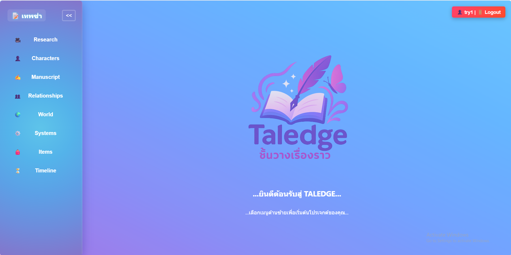
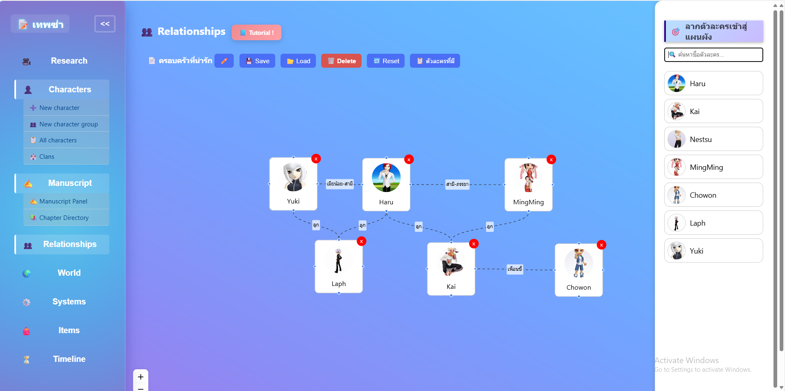
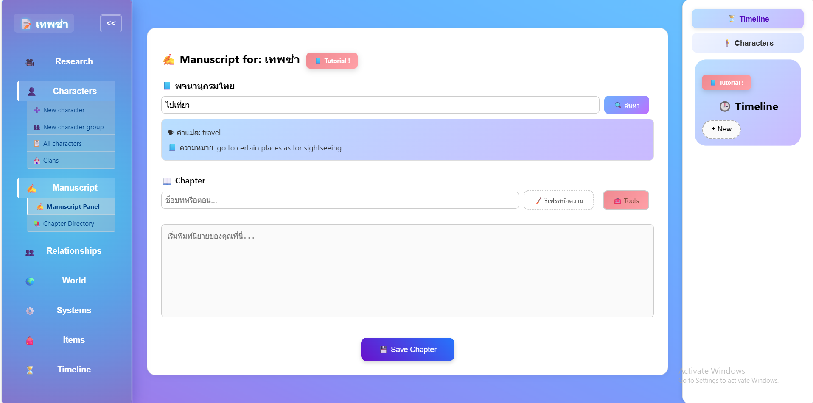
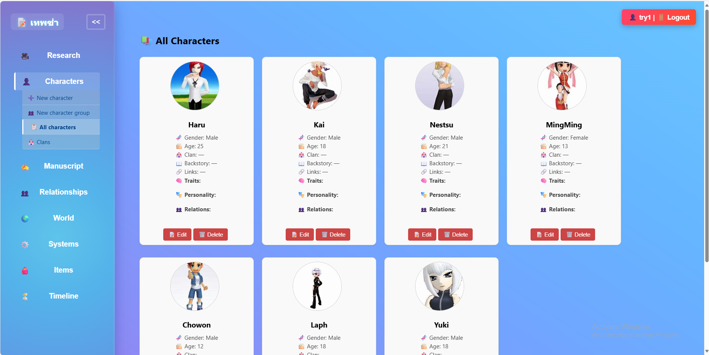

# 📚 TALEDGE — ชั้นวางเรื่องราว

> ระบบจัดการการเขียนนิยายที่รวมเครื่องมือด้านตัวละคร โครงเรื่อง และความสัมพันธ์เข้าไว้ในที่เดียว

---

## 📖 รายละเอียดโครงการ

**ชื่อโครงงาน (ไทย):** ชั้นวางเรื่องราว  
**ชื่อโครงงาน (อังกฤษ):** TALEDGE  
**รหัสโครงงาน:** 67-1_38_skn-r2  
**อาจารย์ที่ปรึกษา:** อาจารย์ สิริกันยา นิลพานิช  

Taledge เป็นแพลตฟอร์มสำหรับนักเขียนนิยาย ที่ให้คุณสามารถ:

- สร้างตัวละครและแคลน
- วาดความสัมพันธ์แบบกราฟ
- จัดการฉาก โลก ไอเท็ม และบทนิยาย
- เชื่อมโยงข้อมูลต่าง ๆ เข้าด้วยกันในรูปแบบของระบบช่วยเขียนที่เป็นระบบ

---

## 🎯 Features

- 👤 สร้างตัวละคร พร้อมภาพ ลิงก์ นิสัย
- 🧬 เชื่อมโยงตัวละครในกราฟความสัมพันธ์
- 🌍 สร้างระบบโลกแบบ Tree/Hierarchy
- 🗓 จัดลำดับเวลาแบบ Timeline
- 📝 เขียนบทนิยายในรูปแบบ Markdown
- 📦 เก็บไอเท็ม, ภาพ, ไฟล์ค้นคว้า
- 🔐 ระบบล็อกอิน/สมัครสมาชิก

---

## 🧰 Technologies Used

| Tech              | Purpose                            |
|-------------------|-------------------------------------|
| React.js          | Frontend SPA                        |
| Node.js + Express | Backend API                         |
| MongoDB           | Database                            |
| Python (Flask)    | Dictionary API (PyThaiNLP + NLTK)   |
| React Flow        | วาดความสัมพันธ์แบบ drag & drop     |
| Tailwind + CSS    | UI Design                           |

---

## 🖥 Screenshots

### 🔍 ภาพรวมระบบ


### 🧩 ความสัมพันธ์ตัวละคร


### ✍️ เขียนบทนิยาย


### 🗓 หน้ารวมตัวละครต่างๆ 


### 🌍 ระบบโลกและไอเท็ม


---

## 🚀 วิธีติดตั้ง

### 1. ติดตั้ง Python และ Node.js

- [✅ ดาวน์โหลด Python](https://www.python.org/downloads/)  
- [✅ ดาวน์โหลด Node.js](https://nodejs.org/en)

---

### 2. Clone โปรเจกต์

```bash
git clone https://github.com/ComSciThammasatU/2567-2-cs403-final-submission-67-1_38_skn-r2.git
cd 2567-2-cs403-final-submission-67-1_38_skn-r2/project
```

---

### 3. Setup ฝั่ง Python (Dictionary API)

```bash
cd server
python -m venv venv
venv\Scripts\activate        # สำหรับ Windows
pip install flask pythainlp nltk
python -m nltk.downloader omw-1.4
python app.py                  # เปิด Dictionary API ที่ http://127.0.0.1:5000/lookup
```

---

### 4. Setup ฝั่ง Node.js (Backend: Express API)

```bash
npm install express mongoose dotenv cors
node server.js                 # หรือ node app.js (ตามชื่อไฟล์หลักของคุณ)
```

> ตรวจสอบให้ไฟล์ `.env` มีค่าเช่นนี้:

```env
MONGODB_URI=mongodb+srv://Guyzaza18121@cluster0.jrkaopc.mongodb.net/fictiondb
PORT=5000
```

---

### 5. Setup ฝั่ง Frontend (React)

```bash
cd ../src
npm install
npm start                      # เปิดหน้าเว็บที่ http://localhost:3000
```

---

## 📂 โครงสร้างโปรเจกต์

```
project/
├── server/
│   ├── app.py, models/, routes/
├── src/
│   ├── pages/, components/
├── public/
├── screenshots/
├── venv/
├── package.json
```

---

## 👨‍👩‍👧‍👦 ผู้จัดทำ

- นาย สิรวิชญ์ ทิมสุวรรณ — sirawich.tim@dome.tu.ac.th  
- นางสาว ณิชาภัทร ชมภูน้อย — nichapat.cho@dome.tu.ac.th  

📌 ไฟล์นี้ใช้ประกอบการส่งโครงงาน คพ.403 ภาคปลาย ปี 2567
